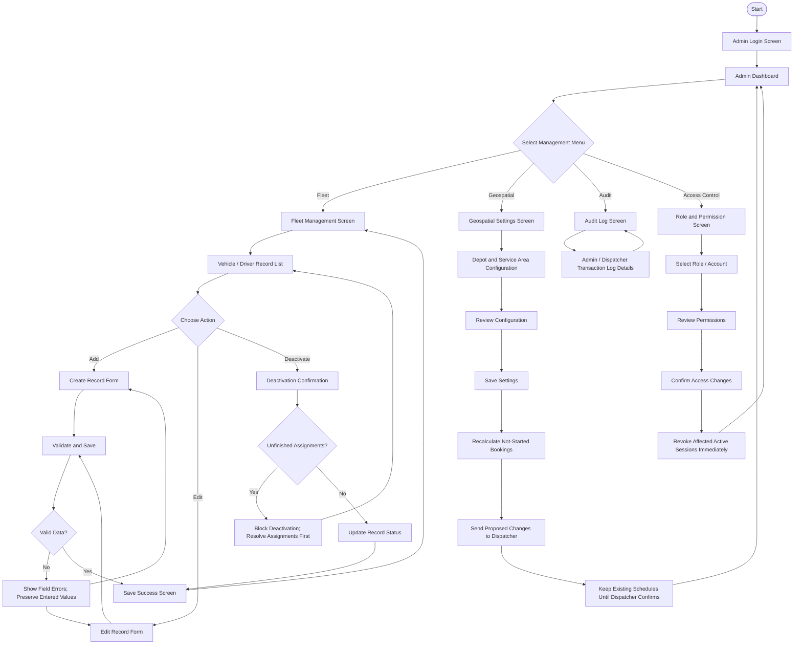

# Administrator User Flow

```mermaid

flowchart TD
    A([Start]) --> B["Admin Login Screen"]
    B --> C["Admin Dashboard"]
    C --> D{"Select Management Menu"}
    D -->|Fleet| E["Fleet Management Screen"]
    D -->|Geospatial| F["Geospatial Settings Screen"]
    D -->|Audit| G["Audit Log Screen"]
    D -->|Access Control| H["Role and Permission Screen"]
    E --> I["Vehicle / Driver Record List"]
    I --> J{"Choose Action"}
    J -->|Add| K["Create Record Form"]
    J -->|Edit| L["Edit Record Form"]
    J -->|Deactivate| M["Deactivation Confirmation"]
    K --> N["Validate and Save"]
    L --> N
    M --> MG{"Unfinished Assignments?"}
    MG -->|Yes| MH["Block Deactivation; Resolve Assignments First"]
    MH --> I
    MG -->|No| O["Update Record Status"]
    N --> P{"Valid Data?"}
    P -->|No| PE["Show Field Errors; Preserve Entered Values"]
    PE --> K
    PE --> L
    P -->|Yes| Q["Save Success Screen"]
    O --> Q
    Q --> E
    F --> R["Depot and Service Area Configuration"]
    R --> S["Review Configuration"]
    S --> T["Save Settings"]
    T --> TI["Recalculate Not-Started Bookings"]
    TI --> TJ["Send Proposed Changes to Dispatcher"]
    TJ --> TK["Keep Existing Schedules Until Dispatcher Confirms"]
    TK --> C
    G --> U["Admin / Dispatcher Transaction Log Details"]
    U --> G
    H --> V["Select Role / Account"]
    V --> W["Review Permissions"]
    W --> X["Confirm Access Changes"]
    X --> XA["Revoke Affected Active Sessions Immediately"]
    XA --> C

```
