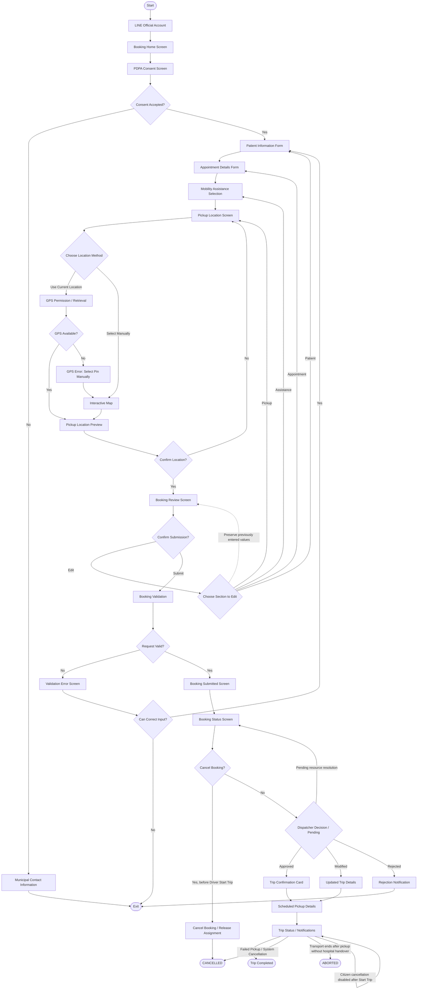

# Citizen / Caregiver User Flow

```mermaid

flowchart TD
    A([Start]) --> B["LINE Official Account"]
    B --> C["Booking Home Screen"]
    C --> D["PDPA Consent Screen"]
    D --> E{"Consent Accepted?"}
    E -->|No| F["Municipal Contact Information"]
    F --> Z([Exit])
    E -->|Yes| G["Patient Information Form"]
    G --> H["Appointment Details Form"]
    H --> I["Mobility Assistance Selection"]
    I --> J["Pickup Location Screen"]
    J --> K{"Choose Location Method"}
    K -->|Use Current Location| L["GPS Permission / Retrieval"]
    K -->|Select Manually| M["Interactive Map"]
    L --> LA{"GPS Available?"}
    LA -->|Yes| N
    LA -->|No| LB["GPS Error: Select Pin Manually"]
    LB --> M
    M --> N
    N["Pickup Location Preview"] --> O{"Confirm Location?"}
    O -->|No| J
    O -->|Yes| P["Booking Review Screen"]
    P --> Q{"Confirm Submission?"}
    Q -->|Edit| QA{"Choose Section to Edit"}
    QA -->|Patient| G
    QA -->|Appointment| H
    QA -->|Assistance| I
    QA -->|Pickup| J
    QA -.->|Preserve previously entered values| P
    Q -->|Submit| R["Booking Validation"]
    R --> S{"Request Valid?"}
    S -->|No| T["Validation Error Screen"]
    T --> U{"Can Correct Input?"}
    U -->|Yes| G
    U -->|No| Z
    S -->|Yes| V["Booking Submitted Screen"]
    V --> W["Booking Status Screen"]
    W --> CX{"Cancel Booking?"}
    CX -->|Yes, before Driver Start Trip| CY["Cancel Booking / Release Assignment"]
    CY --> CZ([CANCELLED])
    CX -->|No| X{"Dispatcher Decision / Pending"}
    X -->|Pending resource resolution| W
    X -->|Approved| Y["Trip Confirmation Card"]
    X -->|Modified| AA["Updated Trip Details"]
    X -->|Rejected| AB["Rejection Notification"]
    Y --> AC["Scheduled Pickup Details"]
    AA --> AC

    AC --> AD["Trip Status / Notifications"]
    AD --> AE([Trip Completed])
    AD -->|Failed Pickup / System Cancellation| CZ
    AD -->|Transport ends after pickup without hospital handover| AX([ABORTED])
    AD -->|Citizen cancellation disabled after Start Trip| AD
    AB --> Z
```
