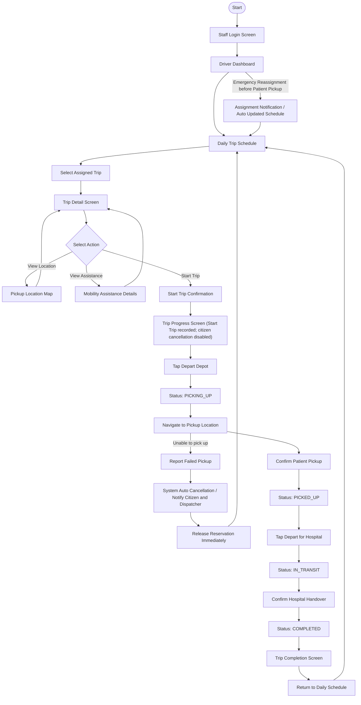

# Driver User Flow

```mermaid

flowchart TD
    A([Start]) --> B["Staff Login Screen"]
    B --> C["Driver Dashboard"]
    C --> D["Daily Trip Schedule"]
    D --> E["Select Assigned Trip"]
    E --> F["Trip Detail Screen"]
    F --> G{"Select Action"}
    C -->|Emergency Reassignment before Patient Pickup| RA["Assignment Notification / Auto Updated Schedule"]
    RA --> D
    G -->|View Location| H["Pickup Location Map"]
    G -->|View Assistance| I["Mobility Assistance Details"]
    G -->|Start Trip| J["Start Trip Confirmation"]
    H --> F
    I --> F
    J --> K["Trip Progress Screen (Start Trip recorded; citizen cancellation disabled)"]
    K --> L["Tap Depart Depot"]
    L --> M["Status: PICKING_UP"]
    M --> N["Navigate to Pickup Location"]
    N --> O["Confirm Patient Pickup"]
    N -->|Unable to pick up| FA["Report Failed Pickup"]
    FA --> FB["System Auto Cancellation / Notify Citizen and Dispatcher"]
    FB --> FC["Release Reservation Immediately"]
    FC --> D
    O --> P["Status: PICKED_UP"]
    P --> Q["Tap Depart for Hospital"]
    Q --> R["Status: IN_TRANSIT"]
    R --> S["Confirm Hospital Handover"]
    S --> T["Status: COMPLETED"]
    T --> U["Trip Completion Screen"]
    U --> V["Return to Daily Schedule"]
    V --> D

```
