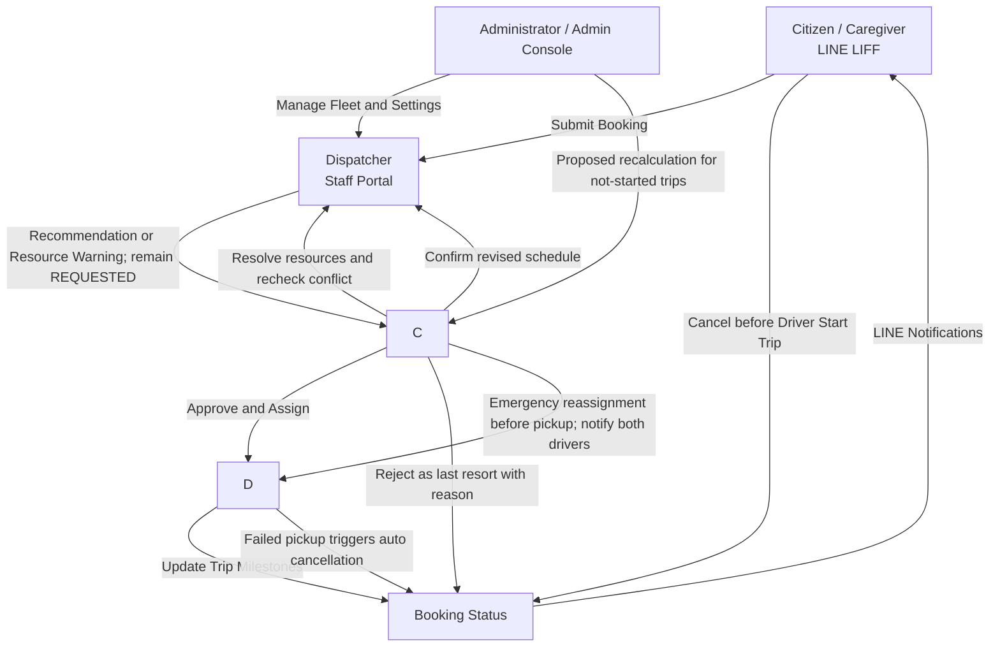

# How 4 actors are connected

```mermaid

flowchart TD
    A["Citizen / Caregiver<br/>LINE LIFF"] -->|Submit Booking| B["Scheduling Engine"]
    B -->|Recommendation or Resource Warning; remain REQUESTED| C
    C -->|Resolve resources and recheck conflict| B["Dispatcher<br/>Staff Portal"]
    C -->|Approve and Assign| D
    C -->|Reject as last resort with reason| E["Driver<br/>Mobile Staff Portal"]
    D -->|Update Trip Milestones| E["Booking Status"]
    E -->|LINE Notifications| A
    F["Administrator / Admin Console"] -->|Manage Fleet and Settings| B
    F -->|Proposed recalculation for not-started trips| C
    C -->|Confirm revised schedule| B
    A -->|Cancel before Driver Start Trip| E
    D -->|Failed pickup triggers auto cancellation| E
    C -->|Emergency reassignment before pickup; notify both drivers| D

```
