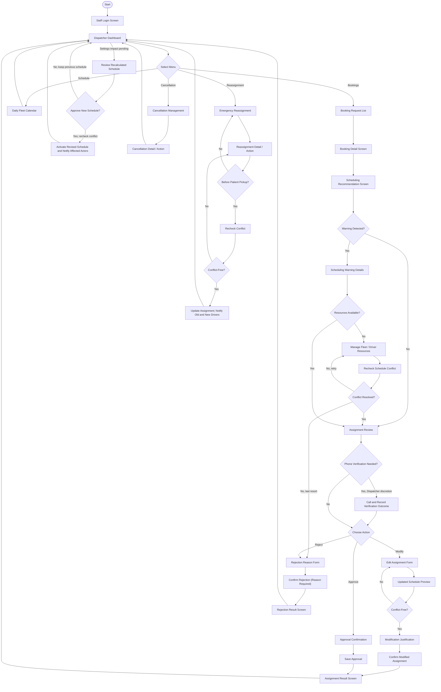

# Municipal_Dispatcher User Flow

```mermaid

flowchart TD
    A([Start]) --> B["Staff Login Screen"]
    B --> C["Dispatcher Dashboard"]
    C --> D{"Select Menu"}
    D -->|Bookings| E["Booking Request List"]
    D -->|Schedule| F["Daily Fleet Calendar"]
    D -->|Cancellation| G["Cancellation Management"]
    D -->|Reassignment| H["Emergency Reassignment"]
    E --> I["Booking Detail Screen"]
    I --> J["Scheduling Recommendation Screen"]
    J --> K{"Warning Detected?"}
    K -->|Yes| L["Scheduling Warning Details"]
    K -->|No| M["Assignment Review"]
    L --> LR{"Resources Available?"}
    LR -->|No| LS["Manage Fleet / Driver Resources"]
    LS --> LT["Recheck Schedule Conflict"]
    LT --> LU{"Conflict Resolved?"}
    LU -->|No, retry| LS
    LU -->|No, last resort| Q
    LU -->|Yes| M
    LR -->|Yes| M
    M --> MV{"Phone Verification Needed?"}
    MV -->|Yes, Dispatcher discretion| MC["Call and Record Verification Outcome"]
    MC --> N{"Choose Action"}
    MV -->|No| N
    N -->|Approve| O["Approval Confirmation"]
    N -->|Modify| P["Edit Assignment Form"]
    N -->|Reject| Q["Rejection Reason Form"]
    P --> R["Updated Schedule Preview"]
    R --> S{"Conflict-Free?"}
    S -->|No| P
    S -->|Yes| T["Modification Justification"]
    T --> U["Confirm Modified Assignment"]
    O --> W["Save Approval"]
    U --> X["Assignment Result Screen"]
    W --> X
    Q --> Y["Confirm Rejection (Reason Required)"]
    Y --> Z["Rejection Result Screen"]
    X --> C
    Z --> C
    F --> C
    C -->|Settings impact pending| SI["Review Recalculated Schedule"]
    SI --> SJ{"Approve New Schedule?"}
    SJ -->|No; keep previous schedule| C
    SJ -->|Yes; recheck conflict| SK["Activate Revised Schedule and Notify Affected Actors"]
    SK --> C
    G --> GA["Cancellation Detail / Action"]
    GA --> C
    H --> HA["Reassignment Detail / Action"]
    HA --> HB{"Before Patient Pickup?"}
    HB -->|No| H
    HB -->|Yes| HC["Recheck Conflict"]
    HC --> HD{"Conflict-Free?"}
    HD -->|No| HA
    HD -->|Yes| HE["Update Assignment; Notify Old and New Drivers"]
    HE --> C

```
